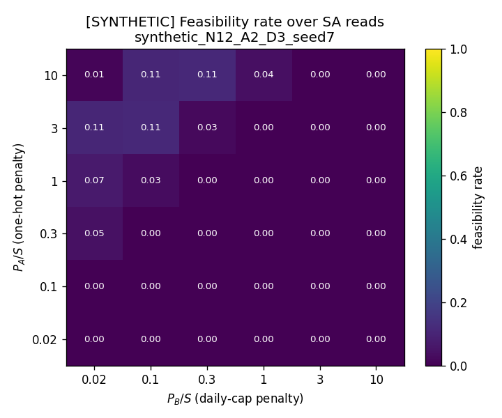
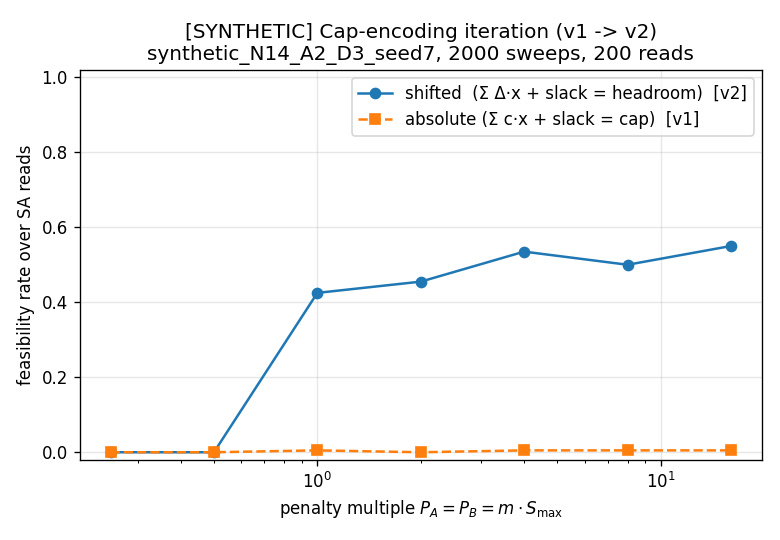
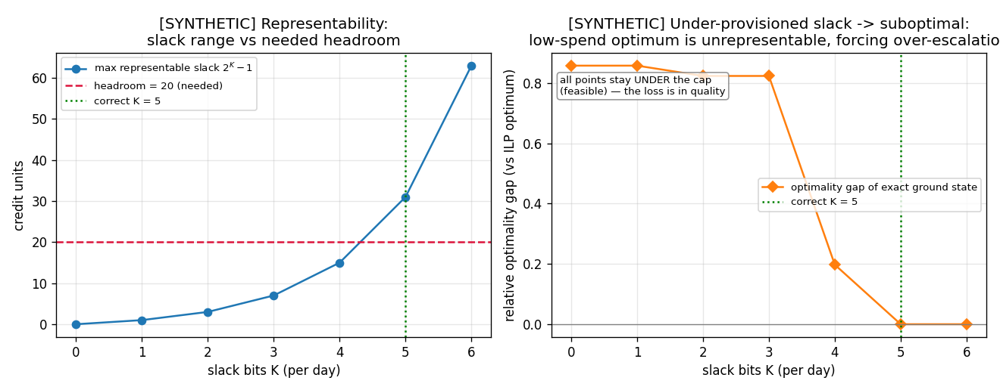
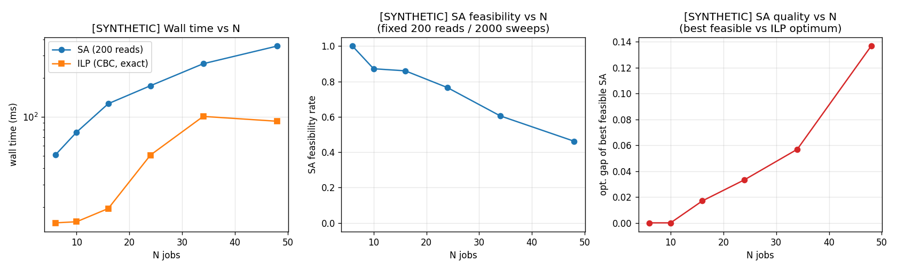
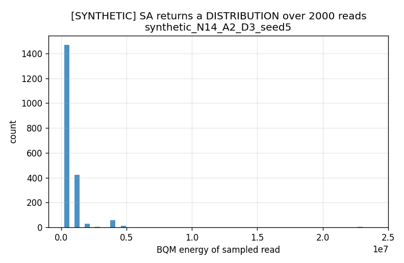
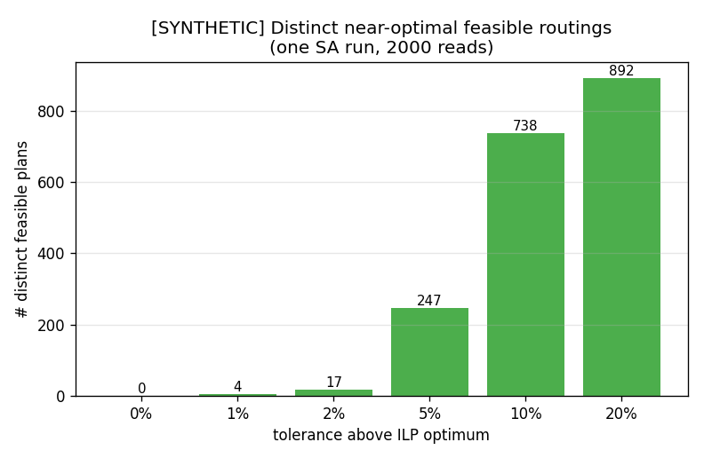
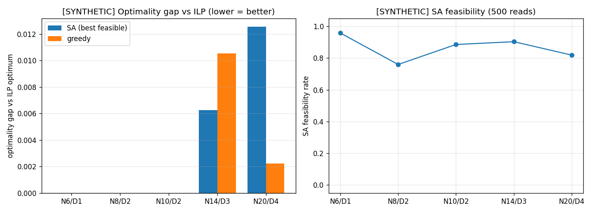

# Stage 2 Report — Resource Allocation for Agentic Research Workflows

**A QUBO model for agentic job-to-tier routing under a hard daily spend cap,
sampled with simulated annealing and benchmarked against exact classical solvers.**

All quantitative results below are on **synthetic** data (labelled `[SYNTHETIC]`
in every figure). Reproduce everything with `python run_all.py` (~25 s).

---

## 1. Problem

A single autonomous research lab runs a queue of jobs performed by a hierarchy of
AI agents (Researcher → Executor → Analyst) with DAG dependencies. Every dispatch
cycle, each pending job must be routed to one of two model tiers — a **cheap
default** or an **expensive escalation** tier — subject to a **hard daily spend
cap** that partitions a fixed multi-week credit budget. The lab already logs
per-job token cost and per-tier spend, and a budget tracker enforces the cap, so
the data exists. The question is operational, not about model quality: *which jobs
is it worth escalating, and when, without blowing any day's cap?*

This is the Stage 2 realisation of the Stage 1 proposal (`proposal/`). Stage 1
posed a single-cycle cost-minimising router with a one-hot constraint, a spend
cap, and an escalation-coupling term; Stage 2 adds the promised DAG structure,
multi-day caps, and a working, benchmarked implementation. Every divergence from
the proposal and the supplied scaffold is logged in [NOTES.md](NOTES.md).

## 2. Formulation

Decision variable `x[i,a] ∈ {0,1}` is 1 iff job `i` runs on tier `a`
(`a = 0` cheap, `a ≥ 1` escalation; the code is general in the number of tiers
`A`). The energy to minimise is

```
H = Σ_{i,a} (c_{i,a} − v_{i,a}) x_{i,a}                                    (objective, linear)
  + P_A Σ_i (1 − Σ_a x_{i,a})²                                            (one-hot,  hard)
  + P_B Σ_d (Σ_{i∈d,a} Δ̃_{i,a} x_{i,a} + Σ_k 2^k s_{d,k} − headroom_d)²   (daily cap, hard, slack)
  + P_C Σ_{i→j} w_{ij} · e_j · (1 − e_i),    e_i = Σ_{a≥1} x_{i,a}        (coupling, soft)
```

Each term, and *why* it is shaped this way:

* **Objective** `(c_{i,a} − v_{i,a})`. `c` is expected token cost; `v` is the value
  of escalating (quality/throughput gain, in token-equivalent credits, with
  `v[:,0]=0`). A job is escalated only where its value beats its marginal cost; the
  cap then forces trade-offs across competing jobs. *Reconciliation:* the Stage 1
  objective was pure cost, under which escalation never pays unless a capability
  mask forces it — the decision problem would be vacuous. The value term is the
  natural generalisation and subsumes the mask as a limiting case (NOTES §1.1).

* **One-hot** `(1 − Σ_a x_{i,a})²`, hard. Each job is assigned to exactly one tier.

* **Daily cap**, hard, as a squared **inequality-with-slack** penalty. For each day,
  `Σ Δ̃·x + slack = headroom`, where `Δ̃_{i,a}=c̃_{i,a}−c̃_{i,0}` is the escalation
  *extra* over the cheap baseline in coarse credit units, `headroom_d = cap_d −
  (all-cheap spend)_d`, and `slack = Σ_k 2^k s_{d,k}` is a binary-encoded slack.
  Because every job runs on at least the cheap tier, daily spend can never drop
  below the all-cheap baseline, so the slack only spans `[0, headroom]` — sizing it
  to that range (not the full cap) is both correct and far cheaper in bits. Costs
  are rounded to a coarse `credit_unit` to keep the slack-bit count tractable; this
  is an explicit realism-vs-tractability trade-off (the cap is then enforced to ±1
  credit unit), validated in §4.2.

* **Escalation coupling** `w_{ij} e_j (1 − e_i)`, soft, over DAG edges `i→j`. It
  penalises *wasted escalation*: spending on an expensive downstream job whose
  upstream input was produced cheaply (a low-quality input bottlenecks the
  expensive step). This `x_j·x_i` product is the genuinely **quadratic** structure
  that makes the problem a QUBO rather than a separable knapsack — the downstream
  escalation's value is not separable from the upstream tier choice. *Reconciliation:*
  Stage 1's coupling rewarded co-escalating shared-context jobs; the scaffold
  replaces it with this DAG term and drops shared-context affinity because prompt
  caching already absorbs most shared-context cost. Adopted, with reasoning in
  NOTES §1.2.

`P_A, P_B` are hard (large); `P_C` is soft (moderate). Calibrating them is §4.1.

The full BQM is built in `src/formulation.py` through a single audited
`add_squared_penalty` helper, and its energy is checked against hand algebra on a
tiny instance (`tests/test_formulation.py::test_hand_computed_energy`).

## 3. Implementation

* **Model** (`dimod` BQM): variables `("x",i,a)` and slack `("s",d,k)`; one helper
  expands every squared penalty to QUBO coefficients.
* **Sampler interface** (`src/solvers.py`): an abstract `Sampler.sample(bqm,
  num_reads) -> SampleSet` with a `SASampler` (dwave-samplers simulated annealing,
  the Stage-2 p-bit stand-in) and an `OrbitAdapter` stub that raises with a TODO.
  Swapping in ORBIT at Stage 3 is a one-line change at the call site.
* **Baselines** (`src/baselines.py`): exhaustive brute force over one-hot plans
  (true constrained optimum, small N); `dimod.ExactSolver` (QUBO ground state,
  tiny); a **PuLP/CBC ILP** solving the identical constrained problem with the
  coupling product linearised exactly (`z_e = e_j(1−e_i)`); and a greedy heuristic.
* **Data** (`src/data.py`): a seeded synthetic generator (role-dependent token
  distributions, an acyclic dependency DAG laid over days, caps set as all-cheap +
  `tightness·headroom`), and a JSON/CSV loader for a real run-DB export. Synthetic
  vs real is labelled in every output; no real export ships with the repo.
* **Validation** (`src/validate.py`): decodes a bitstring and checks the *hard*
  constraints directly in raw tokens — independent of the penalty machinery, so
  feasibility claims are genuine, not a restatement of the energy.
* **Tests**: 23 unit tests (hand-computed energy, constraint detection,
  known-optimum agreement across brute force / ILP / ExactSolver, loader) — all
  green before any result below was produced.

The build is in small commits; the four formulation changes that made the model
actually work under SA are logged in NOTES §5 and surfaced as results in §4.

## 4. Results & iteration

### 4.1 Penalty calibration and the cap-encoding iteration (`experiments/01`)

Penalties are reported as multiples of `S_max = max_{i,a}|c−v|`, the Lagrangian
bound a hard penalty must beat (a single constraint-cheating flip can buy at most
~`S_max` of objective; scaling to the *sum* over jobs instead — as first tried —
inflates the QUBO's dynamic range and starves SA).



The feasible regime is sharp: below `P_A ≈ 1·S_max` the one-hot penalty is too
weak and SA returns **0% feasible** reads (the cheapest way to cut cost is to drop
a job entirely, a one-hot violation); at and above `1·S_max` feasibility rises to
~0.4–0.56 and the best feasible solution sits within ~1% of the ILP optimum
(`results/01_penalty_gap.png`). At the largest penalties (`30·S_max`) the gap
begins to creep back up (e.g. +4.8%) as penalty ridges dwarf the objective and
sampling degrades — the classic too-low/too-high trade-off, located empirically.
`P_A` (one-hot) is the binding knob here, not `P_B`.

**The key iteration.** The first cap encoding used the literal cap
`(Σ c̃·x + slack − B̃)²` ("absolute"). It put every job on a day into one
fully-connected quadratic clique with a large constant baseline, and SA satisfied
it only ~5% of the time. Re-deriving it as `(Σ Δ̃·x + slack − headroom)²`
("shifted") — subtracting the unavoidable all-cheap baseline so cheap-tier
variables drop out of the clique — is identical at feasible points but
dramatically better conditioned:



Across penalty strengths, the shifted encoding reaches ~50% feasibility while the
absolute one stays pinned near ~1%. This single change (NOTES §5.2) is what makes
the rest of the study possible.

### 4.2 Slack-bit validation (`experiments/02`)

On a small single-day instance solved **exactly** (`dimod.ExactSolver`, so the
result is deterministic, not SA noise), with escalation value scaled down so the
true optimum is the low-spend all-cheap plan (which needs slack ≈ full headroom):



The headroom is 20 credit units, so the correct slack count is `K = ceil(log2(21))
= 5` (max representable slack `2⁵−1 = 31 ≥ 20`). Below `K = 5` the feasible
optimum is **unrepresentable**: the slack cannot zero the cap term for the
low-spend plan, so the QUBO ground state is forced into suboptimal **over-escalation**
to fill the gap — the optimality gap runs 0.86 → 0.82 → 0.20 and only collapses to
0 at `K = 5`. Note the solutions stay *under* the cap throughout (the cap is never
violated); the damage is to solution *quality*, not feasibility. At `K = 6` the
extra bit is harmless. This both proves the cap is correctly enforced at the right
`K` and exhibits the precise failure mode of under-provisioning.

### 4.3 Scaling (`experiments/03`)



Under a fixed sampling budget (200 reads, 2000 sweeps), SA feasibility falls from
1.0 at N=6 to ~0.46 at N=48, and the best-feasible optimality gap grows from 0 to
~0.14, while CBC returns the proven optimum throughout in a few–100 ms. SA wall
time grows roughly linearly with N (~50 → ~360 ms; exact ms vary run to run) but
this is *not* a speed claim —
CBC is both faster and exact at these sizes. The point is to locate where a fixed
SA budget starts to degrade, i.e. where more sampling effort (or Stage-3 hardware)
would be needed. **Tiers are harder than jobs**: at fixed N=12, feasibility drops
from 0.86 (A=2) to 0.14 (A=5) and the gap blows up
(`results/03_scaling_tiers.png`), because each extra tier enlarges both the
one-hot constraint and the cap clique.

### 4.4 Solution diversity / re-sampling (`experiments/04`)

This is the honest value proposition of a probabilistic sampler — not beating an
exact solver on one instance, but returning a *distribution* of near-optimal plans
and supporting cheap online re-sampling as costs and the budget drift.




One SA run (2000 reads) on an N=14 instance returns **892 distinct feasible**
routing plans, of which **247 are within 5%** of the ILP optimum; the best is
within +0.48%. Those near-optimal plans are genuinely different decisions — mean
pairwise Hamming distance **4.47 jobs**, with **11 of 14 jobs** taking different
tiers across them. A Supervisor can pick among them on criteria not encoded in `Q`
(latency, provider mix, fairness across agents) without re-solving.

### 4.5 Baseline comparison (`experiments/05`)



| Reference | Role | Result |
| --- | --- | --- |
| `dimod.ExactSolver` | QUBO ground state vs ILP optimum | **5/5 match** at N=6 — the penalty QUBO is *faithful* (same optimum as the constrained problem) |
| brute force | true constrained optimum vs ILP | **5/5 match** up to N=14 — the ILP is the correct reference |
| PuLP/CBC ILP | proven optimum / feasibility reference | exact at all tested sizes |
| SA | sampler under test | best-feasible gap **0–1.3%**, feasibility 0.76–0.96 |
| greedy | cheap heuristic | comparable gap, for context |

ExactSolver agreement confirms the formulation is faithful; ILP-vs-brute-force
agreement confirms the ILP is the true optimum; SA matches or slightly trails it,
as expected for a stochastic sampler. **No claim of SA/p-bit superiority over
classical solvers is made** — consistent with the Stage 1 thesis that any advantage
would emerge only as coupling and contention densify, which these instance sizes do
not reach.

## 5. Limitations (stated plainly)

* **Synthetic data.** Every result is on generated instances; the token
  distributions, DAG shapes and caps are *plausible*, not measured. The loader is
  ready for a real run-DB export but none was supplied. Nothing here should be read
  as a measurement of a real lab.
* **SA is a proxy for ORBIT.** Simulated annealing stands in for the Stage-3 p-bit
  hardware. SA's feasibility/quality figures are properties of SA, not predictions
  for ORBIT; the `OrbitAdapter` is an unimplemented stub.
* **Cost rounding.** Coarse credit units keep slack tractable but enforce the cap
  only to ±1 unit; a rounded-feasible plan can be raw-infeasible by up to one unit.
  Finer units cost more slack bits and harder sampling (the §4.2 trade-off).
* **The cap penalty is hard for SA.** The squared-slack inequality is the dominant
  source of difficulty; feasibility degrades with N and especially with the number
  of tiers (§4.3). The shifted encoding mitigates but does not eliminate this.
* **No claims beyond the evidence.** SA does not beat CBC here and we do not imply
  it should; the contribution is a faithful, calibrated QUBO and an honest map of
  where sampling helps (diversity, re-sampling) and where it struggles (scale,
  tiers).

## 6. Mapping to the Stage 2 assessment criteria

**1 — Formulation quality.** §2 gives a correct discrete encoding with every term
justified against the real problem structure (objective with escalation value,
hard one-hot, hard daily cap via baseline-shifted binary slack, soft quadratic
wasted-escalation coupling). The quadratic coupling is what makes it a true QUBO.
Faithfulness is *proved*, not asserted: hand-computed energy
(`tests/test_formulation.py`) and ExactSolver==ILP==brute-force agreement (§4.5).
Reconciliation with the Stage 1 proposal is explicit in [NOTES.md](NOTES.md).

**2 — Implementation & iteration.** A working prototype (`src/`, 23 passing tests)
with documented iteration: the cap encoding (v1 absolute → v2 shifted, ~5% → ~80%
feasible, §4.1), range-sized slack, `S_max` penalty scaling, and interpretable cap
generation — each a failure found and fixed, logged in NOTES §5 and shown in
results. Five experiments exercise calibration, slack sufficiency, scaling,
diversity, and baselines.

**3 — Baselines & clarity.** Three classical references on the *same* problem —
brute force, `dimod.ExactSolver`, and a PuLP/CBC ILP — plus a greedy heuristic,
with optimality gap, feasibility, and cross-solver agreement reported in tables and
figures (§4.5, `results/05_*`). Synthetic data is labelled as such throughout, and
limitations are stated without overclaiming.

---

*Reproduce: `pip install -r requirements.txt && python run_all.py`. Figures in
`results/`, formulation and reconciliation in `NOTES.md`.*
